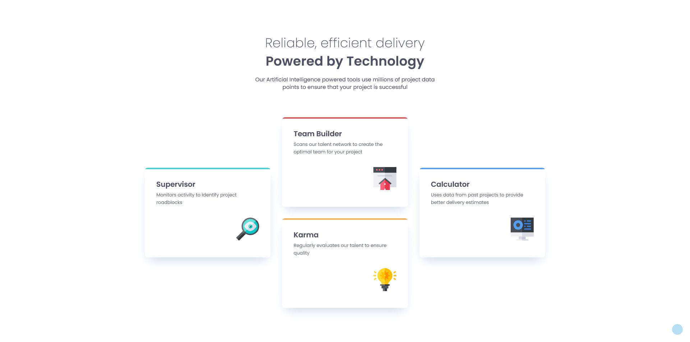

# Frontend Mentor - Four card feature section solution

This is a solution to the [Four card feature section challenge on Frontend Mentor](https://www.frontendmentor.io/challenges/four-card-feature-section-weK1eFYK). Frontend Mentor challenges help you improve your coding skills by building realistic projects. 

## Table of contents

- [Overview](#overview)
  - [The challenge](#the-challenge)
  - [Screenshot](#screenshot)
  - [Links](#links)
- [My process](#my-process)
  - [Built with](#built-with)
  - [What I learned](#what-i-learned)
  - [Continued development](#continued-development)
- [Author](#author)

## Overview

### The challenge

Users should be able to:

- View the optimal layout for the site depending on their device's screen size

### Screenshot



### Links

- [Solution URL]()
- [Live Site URL]()

## My process

### Built with

- Semantic HTML5 markup
- CSS custom properties
- Flexbox

### What I learned

I was a bit nervous about adding the colored line on top of the cards and wasn’t sure how easy it would be to achieve. Surprisingly, I solved it quickly and easily, which showed me that I’ve definitely improved xD

```css
.card-color {
  position: absolute;
  top: 0;
  left: 0;
  right: 0;
  height: 4px;
}
```

### Continued development

I will work towards writing more flexible code in the future, incorporating best practices along the way.

## Author

- Frontend Mentor - [@Trischa-99](https://www.frontendmentor.io/profile/Trischa-99)
